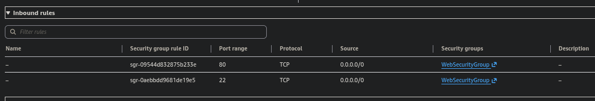

# AWS Security Incident Investigation with CloudTrail & Athena

Investigated and remediated a simulated breach of an EC2-hosted web server. Enabled CloudTrail auditing, traced the attacker through three log-analysis methods, identified the compromised IAM identity, and remediated at the OS, network, and IAM levels.

## Skills

AWS CloudTrail · Amazon Athena (SQL) · AWS CLI · Linux forensics · SSH hardening · IAM security · Incident response

## Scenario

A café's public web server was defaced after an unauthorized SSH rule (port 22, 0.0.0.0/0) was added to its security group. With CloudTrail newly enabled, the task was to identify who made the change, when, from where, and how — then remediate fully.

## Investigation

**Detection** — Website found defaced; a rogue inbound rule (SSH, 0.0.0.0/0) was found on the instance's security group.




**Method 1: grep** — Downloaded CloudTrail .json.gz logs from S3 and filtered entries by `sourceIPAddress` and `eventName` using scripted grep loops.


**Method 2: AWS CLI** — Used `cloudtrail lookup-events` filtered by security group ID to surface the relevant event.


**Method 3: Athena** — Created an external table over the CloudTrail logs and isolated the actor with SQL.

```sql
SELECT useridentity.username, eventtime, eventname, sourceipaddress
FROM cloudtrail_logs_aws_cloudtrail_logs_739570699703_7325d0a5
WHERE eventname = 'AuthorizeSecurityGroupIngress';
