# AWS Security Incident Investigation with CloudTrail & Athena

Investigated and remediated a simulated breach of an EC2-hosted web server. Enabled CloudTrail auditing, traced the attacker through three log-analysis methods, identified the compromised IAM identity, and remediated at the OS, network, and IAM levels.

## Skills

AWS CloudTrail · Amazon Athena (SQL) · AWS CLI · Linux forensics · SSH hardening · IAM security · Incident response

## Scenario

A cafe's public web server was defaced after an unauthorized SSH rule (port 22, 0.0.0.0/0) was added to its security group. With CloudTrail newly enabled, the task was to identify who made the change, when, from where, and how — then remediate fully.

## 1. Establish a Baseline

Before the incident, the web application was running normally and the security group contained only expected inbound rules.

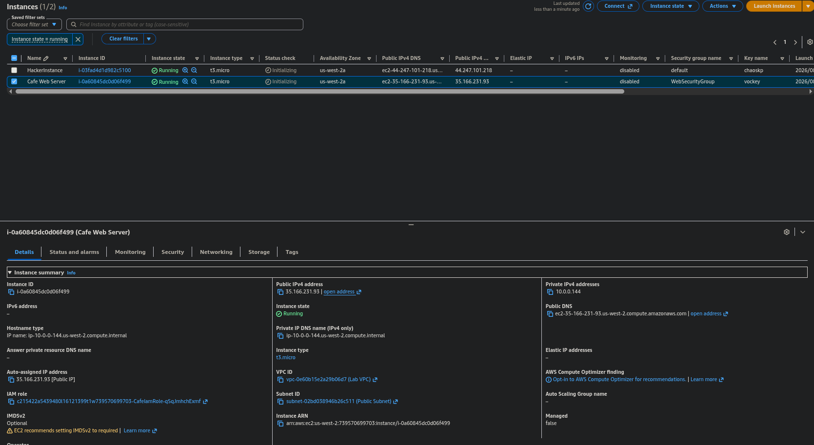

*Web server in its expected state before the compromise.*

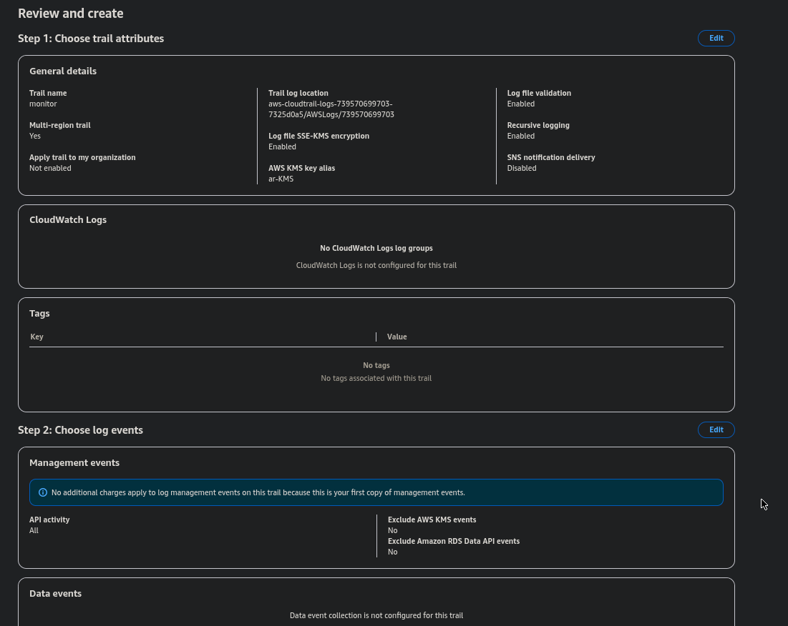

*Baseline security group configuration with only approved inbound rules.*

## 2. Enable Auditing with CloudTrail

With no existing audit trail, the first step was to configure a multi-region CloudTrail trail delivering logs to S3 for centralized record keeping.

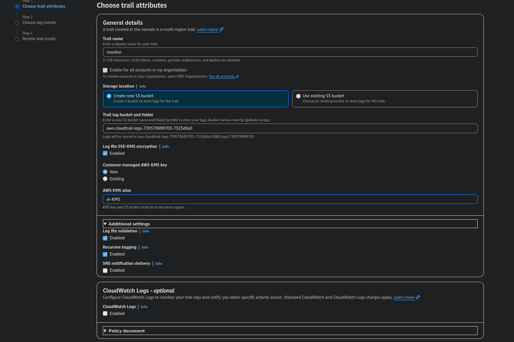

*Creating a new CloudTrail trail.*


*Confirmed trail collecting management events for the account.*

## 3. Detect the Compromise

The web server was found defaced, and inspection of its security group revealed a rogue inbound rule permitting SSH (port 22) from anywhere on the internet.

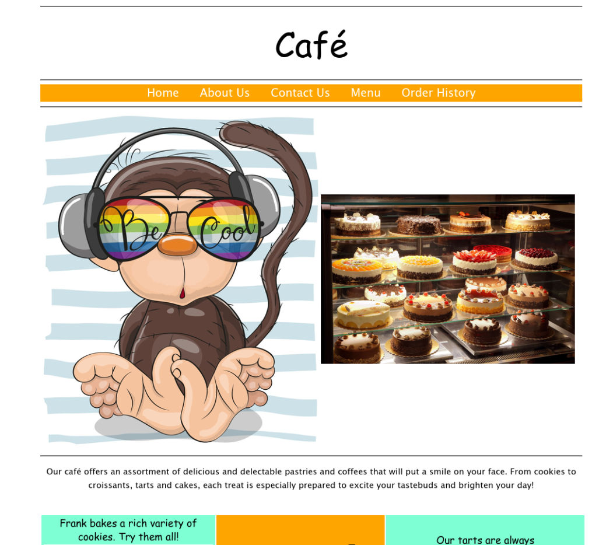
*Website after unauthorized modification.*

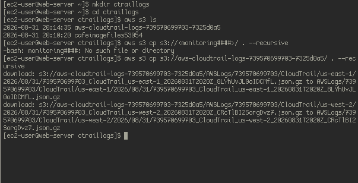

*Rogue inbound rule: SSH on port 22 open to 0.0.0.0/0.*

## 4. Investigate the Incident

Three independent methods were used to correlate the change to a specific actor, timestamp, and source IP.

### Method 1: Manual Log Analysis (grep)

CloudTrail logs (.json.gz) were downloaded from S3 and parsed with scripted grep loops, filtering entries by `sourceIPAddress` and `eventName`.

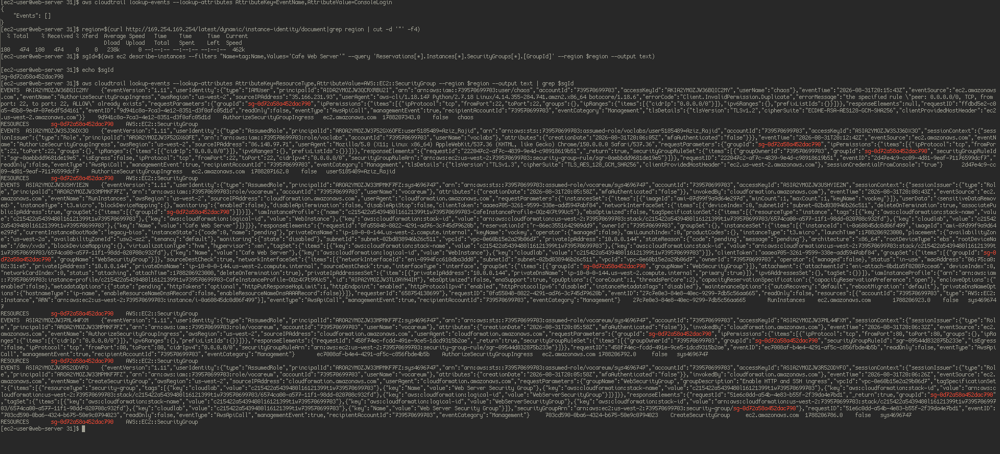

*Downloading CloudTrail log archives for offline analysis.*

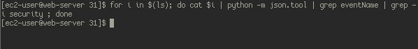

*Filtering CloudTrail entries by event and source IP.*

### Method 2: AWS CLI

Used `cloudtrail lookup-events` filtered by the target security group ID to surface the relevant event directly from the API.

```bash
aws cloudtrail lookup-events \
  --lookup-attributes AttributeKey=ResourceName,AttributeValue=<security-group-id>
```

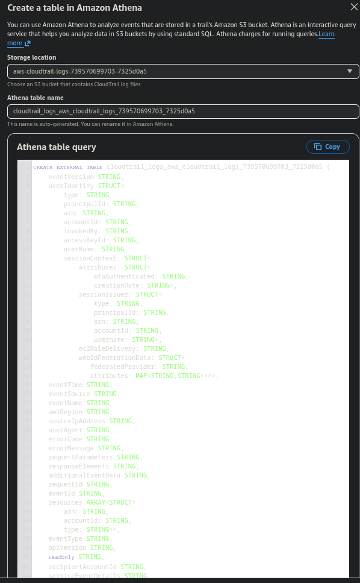

*CloudTrail lookup-events filtered by security group.*

### Method 3: Amazon Athena (SQL)

Created an external table over the CloudTrail logs in S3 and isolated the responsible identity with a single query.

```sql
SELECT useridentity.username, eventtime, eventname, sourceipaddress
FROM cloudtrail_logs_aws_cloudtrail_logs_739570699703_7325d0a5
WHERE eventname = 'AuthorizeSecurityGroupIngress';
```

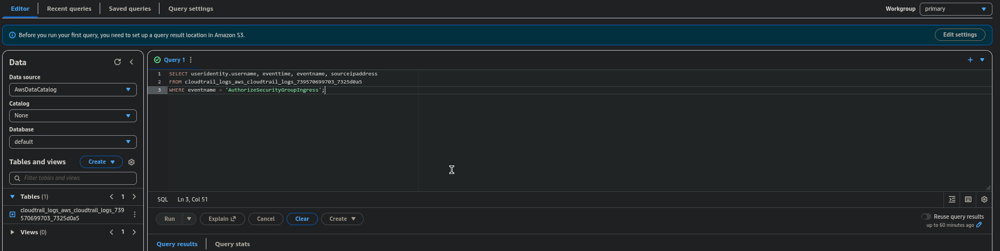

*Athena pinpointing the identity, timestamp, and source IP behind the change.*

## 5. Remediate

Findings were addressed at the operating-system, network, and IAM levels.

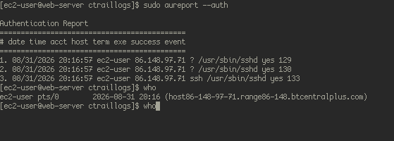

*Hardening the host and removing attacker access.*

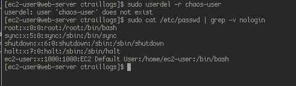

*Service verified back to normal operation.*

## Supporting Evidence

Additional screenshots documenting intermediate steps of the investigation.

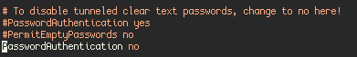


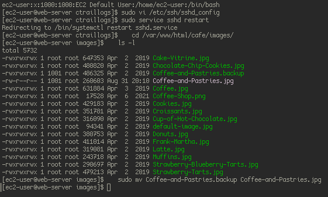

Website Pictures

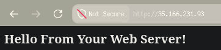

Website Working 


